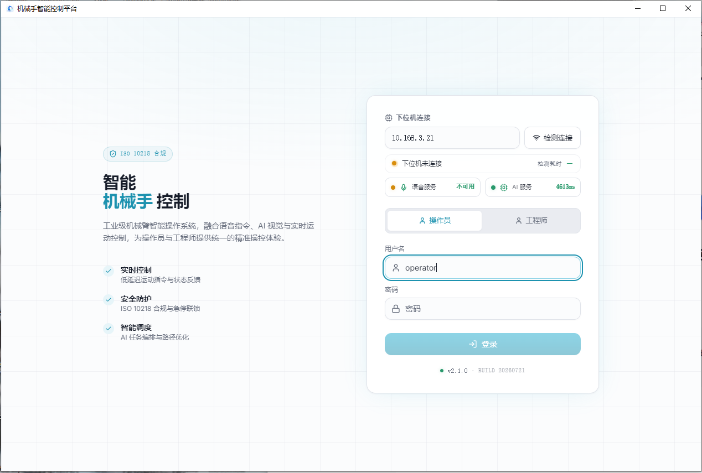
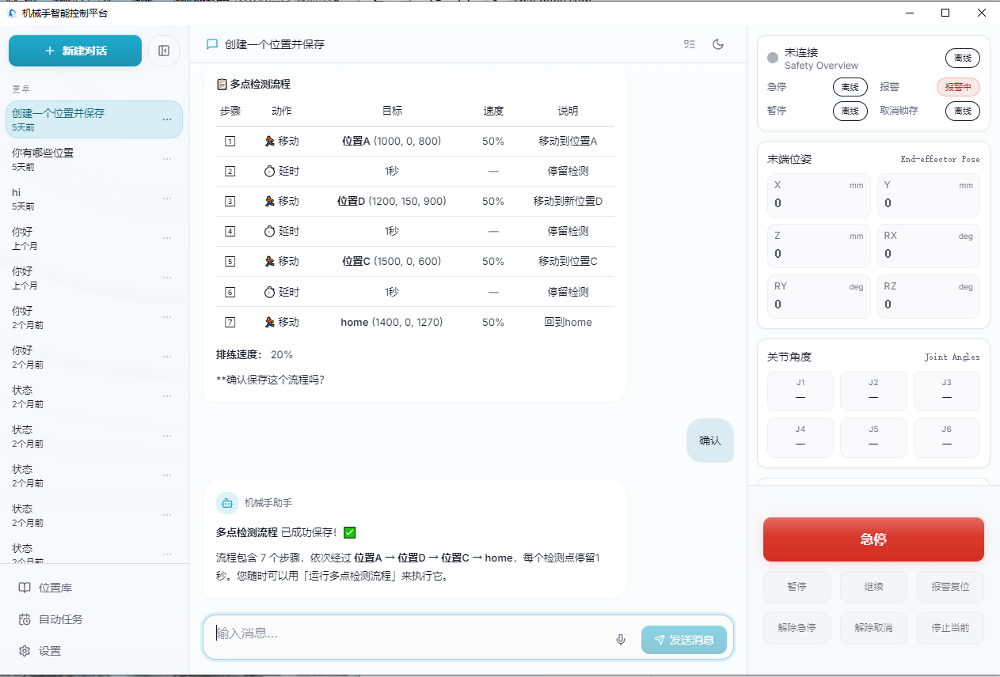

# MotionFlow AI - 机器人手臂 AI 平台

MotionFlow AI 是一个基于 AI 的机器人手臂控制平台，支持多种交互方式（WebUI、CLI、桌面应用），并提供完整的工具生态系统来实现机器人自动化任务。

## 核心特性

### 🤖 智能机器人控制
- **多自由度控制**：支持位置、流量、库和流程的精确控制
- **AI 驱动执行**：通过大语言模型理解和执行自然语言指令
- **安全执行机制**：完整的执行许可和确认机制确保操作安全
- **自动编排**：支持自动流量和自动运动的高级编排功能

### 🧠 AI 运行时架构
- **多模型支持**：集成 Anthropic、OpenAI、Azure OpenAI、Bedrock、GitHub Copilot 等多种 AI 提供商
- **Provider 抽象层**：统一的 Provider 接口支持模型热切换和降级策略
- **思考和推理支持**：完整的思考标签处理和推理内容提取
- **模型预设系统**：支持预设配置和动态模型选择

### 🛠️ 工具系统
- **核心工具集**：文件系统操作、Shell 执行、搜索工具等
- **机器人专用工具**：位置、流量、知识库、命令库等专业工具
- **MCP 集成**：支持 Model Context Protocol 服务器扩展
- **工具审计追踪**：完整的工具调用审计和操作记录

### 📡 多种交互通道
- **WebUI**：现代化的 Web 界面
- **CLI**：命令行交互
- **Electron 桌面应用**：Windows 桌面客户端（MotionFlow AI Windows 桌面版）
- **WebSocket 实时通信**：支持流式响应和实时事件

### ⏰ 自动化能力
- **Cron 定时任务**：支持 crontab 风格的定时执行
- **本地触发器**：事件驱动的自动化执行
- **自动化回合协调**：延迟和并发控制
- **长期目标任务**：支持长周期目标管理和完成确认


## 页面


## 系统架构

```
MotionFlow AI Platform
├── 📦 nanobot-main-1 (核心 Python 应用)
│   ├── 🤖 agent/          # AI Agent 循环和上下文管理
│   ├── 🚌 bus/           # 消息总线和事件系统
│   ├── 📡 providers/     # AI 提供商适配器
│   ├── 🛠️ tools/         # 工具实现
│   ├── 📅 cron/          # 定时任务服务
│   ├── 🎯 session/       # 会话管理
│   └── 🔐 security/      # 安全边界和访问控制
│
├── 🖥️ desktop (Electron 桌面应用)
│   ├── electron/         # Electron 主进程和渲染进程
│   └── pyinstaller/      # Python 打包配置
│
├── 📖 docs/              # 架构文档和设计规范
│   └── architecture/     # 模块化迁移和架构决策
│
└── 🤖 robot_platform/    # 机器人平台后端
    ├── adapters/         # 文件适配器和接口实现
    └── application/      # 应用服务和业务逻辑
```

## 快速开始

### 环境要求

- **Python**: 3.10 或更高版本
- **Node.js**: 18+ (用于 Electron 桌面应用)
- **系统**: Windows 10/11, macOS, 或 Linux

### 安装

#### 方式一：使用 uv (推荐)

```bash
# 克隆仓库
git clone https://gitee.com/csucyj/nanobot-robotic-arms.git
cd nanobot-robotic-arms/nanobot-main-1

# 使用 uv 创建虚拟环境并安装
uv venv
source .venv/bin/activate  # Linux/macOS
# .venv\Scripts\activate   # Windows
uv pip install -e .
```

#### 方式二：使用 pip

```bash
# 克隆仓库
git clone https://gitee.com/csucyj/nanobot-robotic-arms.git
cd nanobot-robotic-arms/nanobot-main-1

# 创建虚拟环境
python -m venv venv
source venv/bin/activate  # Linux/macOS
# venv\Scripts\activate   # Windows

# 安装依赖
pip install -e .
```

### 配置

1. 复制配置文件模板：

```bash
cp config.yaml.example config.yaml
```

2. 编辑配置文件（可选）：

```yaml
# config.yaml
providers:
  anthropic:
    api_key: ${ANTHROPIC_API_KEY}  # 支持环境变量引用
    default_model: claude-sonnet-4-20250514

# 或使用 OpenAI 兼容接口
providers:
  openai:
    api_key: ${OPENAI_API_KEY}
    api_base: https://api.openai.com/v1
    default_model: gpt-4o
```

3. 设置环境变量：

```bash
export ANTHROPIC_API_KEY="your-api-key"
# 或
export OPENAI_API_KEY="your-api-key"
```

### 运行

#### 启动 WebUI 服务

```bash
nanobot run
```

然后在浏览器中访问 http://localhost:8080

#### 使用 CLI

```bash
# 交互模式
nanobot chat

# 单次执行
nanobot run "请帮我移动到位置 A"

# 指定会话
nanobot run --session "my-session" "执行流程 B"
```

#### 使用 SDK

```python
import asyncio
from nanobot import Nanobot

async def main():
    bot = Nanobot.from_config()
    
    # 执行任务
    result = await bot.run("移动到待机位置")
    print(result.text)
    
    # 流式响应
    async for event in bot.stream("执行高级动作"):
        print(event)

asyncio.run(main())
```

## 开发指南

### 项目结构

```
nanobot-main-1/
├── nanobot/
│   ├── agent/           # Agent 核心逻辑
│   ├── bus/             # 消息总线
│   ├── providers/       # AI 提供商
│   ├── tools/           # 工具实现
│   ├── cron/            # 定时任务
│   ├── session/         # 会话管理
│   ├── security/        # 安全模块
│   └── sdk/             # SDK 接口
├── desktop/             # Electron 桌面应用
├── docs/                # 文档
├── robot_platform/      # 机器人平台
└── tests/               # 测试
```

### 运行测试

```bash
# 运行所有测试
pytest tests/

# 运行特定模块测试
pytest tests/agent/
pytest tests/providers/

# 运行类型检查
pytest tests/ --typeguard-mode=strict
```

### 代码风格

项目使用ruff进行代码检查和格式化：

```bash
# 检查代码
ruff check .

# 自动修复
ruff check --fix .
```

### 贡献代码

1. Fork 项目
2. 创建功能分支：`git checkout -b feature/your-feature`
3. 提交更改：`git commit -m 'Add some feature'`
4. 推送到分支：`git push origin feature/your-feature`
5. 创建 Pull Request

## 工具系统

### 内置工具

| 工具 | 功能 | 分类 |
|------|------|------|
| read_file | 读取文件 | 核心 |
| write_file | 写入文件 | 核心 |
| edit_file | 编辑文件 | 核心 |
| list_dir | 列出目录 | 核心 |
| find_files | 查找文件 | 核心 |
| grep | 搜索内容 | 核心 |
| exec | 执行 Shell 命令 | 核心 |
| exec_session | 交互式执行会话 | 核心 |
| robot_position | 机器人位置控制 | 机器人 |
| robot_flow | 机器人流程控制 | 机器人 |
| robot_knowledge | 知识库查询 | 机器人 |
| robot_library | 命令库管理 | 机器人 |
| cron | 定时任务管理 | 自动化 |
| long_task | 长期目标任务 | 自动化 |
| spawn | 触发子任务 | 自动化 |
| web_search | 网络搜索 | 外部 |
| web_fetch | 获取网页内容 | 外部 |
| image_generation | 图像生成 | 外部 |
| cli_apps | CLI 应用集成 | 集成 |
| message | 跨通道消息 | 消息 |

### 自定义工具

```python
from nanobot.tools import Tool, tool_parameters

@tool_parameters({
    "name": StringSchema("参数名称", description="描述"),
    "required": ["name"]
})
class MyTool(Tool):
    @property
    def name(self) -> str:
        return "my_tool"
    
    @property
    def description(self) -> str:
        return "我的自定义工具"
    
    async def execute(self, name: str) -> str:
        return f"Hello, {name}!"
```

## 安全特性

### 运行时安全边界

- **工作区隔离**：工具默认只能访问指定工作区
- **SSRF 防护**：防止服务器端请求伪造攻击
- **文件访问控制**：细粒度的文件系统权限控制
- **Shell 沙箱**：可选的 bwrap 沙箱支持

### 机器人执行安全

```yaml
security:
  # 执行许可配置
  execution_permit:
    required: true
    # 危险命令确认
    dangerous_commands:
      - "emergency_stop"
      - "power_off"
```

### 敏感信息保护

- API 密钥不进入代码仓库
- 支持环境变量配置
- 配置文件权限控制
- 审计日志脱敏

## 高级配置

### 多模型配置

```yaml
model_presets:
  default:
    provider: anthropic
    model: claude-sonnet-4-20250514
    temperature: 0.7
  
  code_assistant:
    provider: anthropic
    model: claude-3-5-sonnet-20241022
    temperature: 0.3
  
  creative:
    provider: openai
    model: gpt-4o
    temperature: 0.9
```

### 会话配置

```yaml
session:
  # 会话 TTL (分钟)
  ttl_minutes: 60
  # 自动压缩阈值
  auto_compact:
    enabled: true
    threshold: 0.5
```

### 工具白名单

```yaml
tools:
  # 启用的核心工具
  enabled:
    - "read_file"
    - "write_file"
    - "exec"
    # ...
  
  # 禁用的危险工具
  disabled:
    - "sudo"
    - "rm"
```

## 故障排查

### 常见问题

**1. 模型连接失败**
```bash
# 检查 API 密钥配置
echo $ANTHROPIC_API_KEY

# 测试连接
nanobot doctor
```

**2. 工具执行失败**
```bash
# 查看详细日志
nanobot run -vv "执行命令"

# 检查工作区权限
nanobot doctor --workspace
```

**3. 桌面应用启动问题**
```bash
# Windows: 查看日志
type %APPDATA%\nanobot\logs\error.log

# 检查 Python 环境
where python
python --version
```

### 日志位置

- **Linux/macOS**: `~/.config/nanobot/logs/`
- **Windows**: `%APPDATA%\nanobot\logs\`

## 相关资源

- **文档**: [docs/README.md](docs/README.md)
- **架构文档**: [docs/architecture/](docs/architecture/)
- **问题反馈**: [GitHub Issues](https://github.com/csucyj/nanobot-robotic-arms/issues)
- **更新日志**: [CHANGELOG.md](CHANGELOG.md)

## License

本项目采用 MIT License 许可证，详情请参阅 [LICENSE](LICENSE) 文件。

## 致谢

感谢所有为这个项目做出贡献的开发者！

---

**提示**: 如需了解详细的技术架构和设计决策，请参阅 [docs/architecture/](docs/architecture/) 目录下的文档。